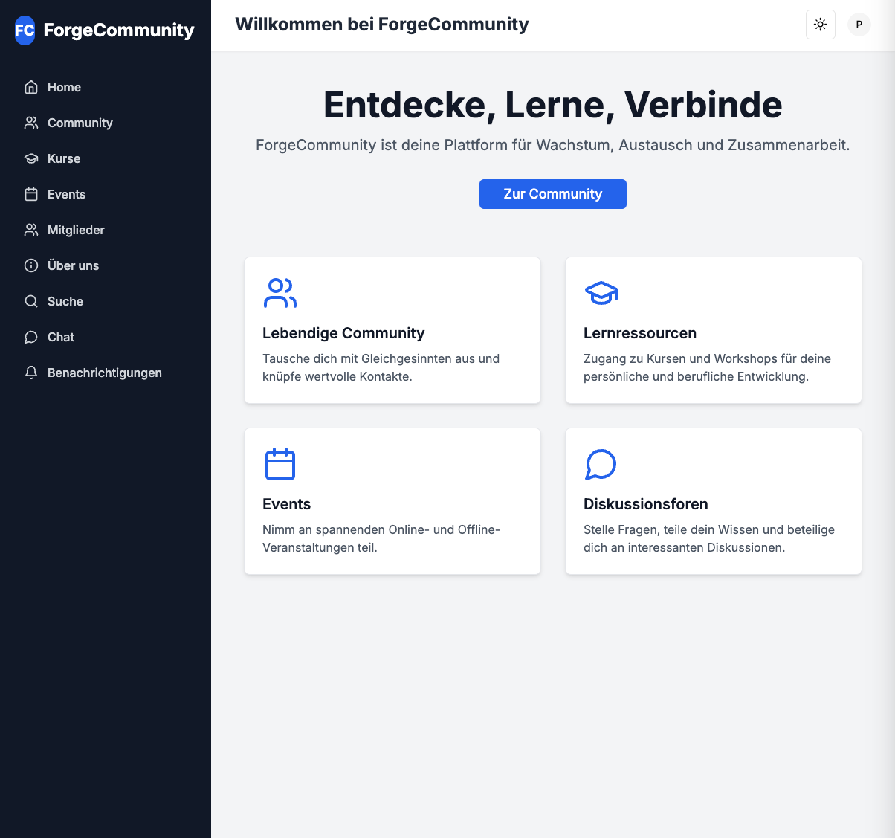

# ForgeCommunity

ForgeCommunity is a comprehensive platform designed to foster learning, collaboration, and community engagement. It provides a space for users to access courses, participate in events, and connect with other community members.

## Features

- **Home**: A welcoming dashboard that provides an overview of the platform's features and recent activities.
- **Community**: A space for members to interact, share ideas, and collaborate on projects.
- **Courses**: Access to a wide range of educational content and learning materials.
- **Events**: A calendar view of upcoming events, workshops, and meetups.
- **Members**: A directory of community members, facilitating networking and collaboration.
- **About**: Information about the platform, its mission, and the team behind it.
- **Search**: A powerful search functionality to find content across the platform.
- **Chat**: Real-time messaging capabilities for direct communication between members.
- **Notifications**: A system to keep users informed about important updates and activities.

## Technology Stack

- **Frontend**: Next.js with TypeScript
- **UI Components**: Shadcn UI
- **Styling**: Tailwind CSS
- **Icons**: Lucide React
- **Date Handling**: date-fns

## Getting Started

