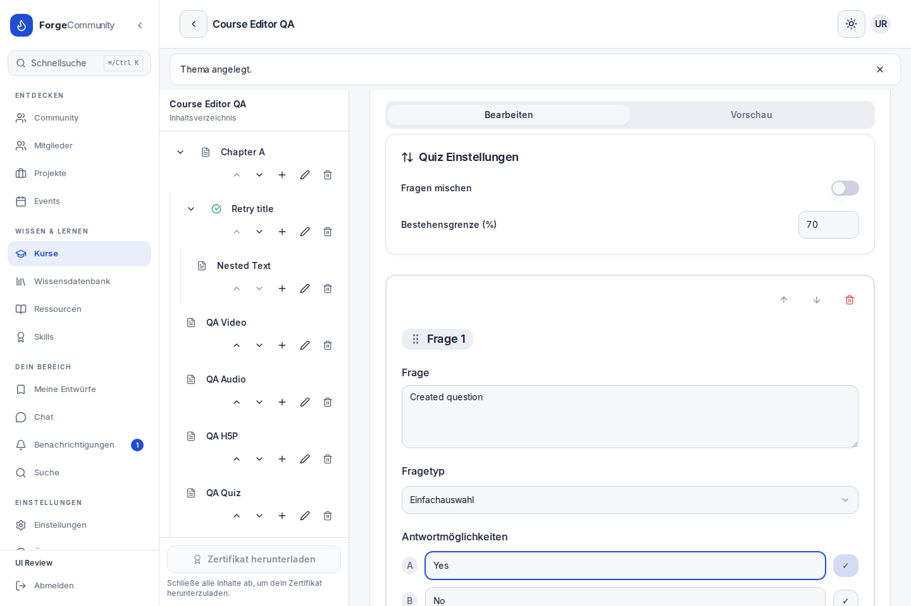
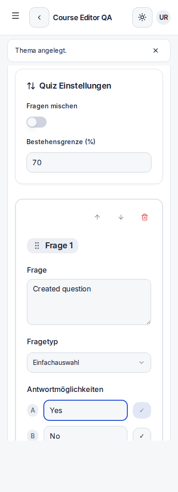

# Kurseditor: Inhaltspflege und Datenzuverlässigkeit

Der Kurseditor trennt gespeicherte Inhalte von lokalen Entwürfen. Kapitel, Themen und Unterthemen werden in einem rekursiven Inhaltsverzeichnis gepflegt. Die Bearbeitungsrechte stammen aus der Kurs-API; Lernende erhalten eine Leseansicht.

## Behobene Fehler

| Ablauf | Vorher | Jetzt |
| --- | --- | --- |
| Abbrechen | Titel/Inhalt änderten bereits den sichtbaren Kursbaum. | Entwurf bleibt getrennt; Verwerfen verändert gespeicherte Daten nicht. |
| Speichern eines Kapitels | Die lokale Antwort ersetzte den Elternknoten und verlor dessen Kinder. | Der Unterbaum bleibt erhalten, auch bei mehreren Ebenen. |
| Fehlgeschlagene Aktionen | Fehler wurden verschluckt, Dialoge geschlossen oder Zeilen voreilig entfernt. | Eingaben und Dialoge bleiben erhalten; Speichern/Löschen lassen sich wiederholen. |
| Umbenennen | Enter und Blur konnten doppelt speichern; tiefe Themen wurden nicht aktualisiert. | Explizites Speichern, Abbrechen und Escape; ein Request, rekursive Aktualisierung. |
| Sortieren | Falsche Callback-ID; identische Rangwerte; unabhängige PUTs mit möglichen Teiländerungen. | Richtige Parent-/Child-ID, atomare Reihenfolge, auch für Hauptkapitel. |
| Verschieben | Keine verlässliche Aktion für Tastatur und Touch. | Zielauswahl mit Unterbaum; eigene Nachfahren sind ausgeschlossen, die API verhindert Zyklen. |
| Inhaltstyp wechseln | Wechsel löschte den bisherigen Entwurf. | Pro Typ bleibt der Entwurf bis zum Speichern/Verwerfen erhalten. |
| Quiz bearbeiten | String-/Objektformate, Vorschau und Antwortindizes waren inkonsistent. | Gemeinsamer Legacy-Parser, direkte Formularänderungen, Vorschau ohne Speichern und korrekte Antwortzuordnung. |
| Medien | Queryparameter wurden HTML-kodiert; H5P-Quellen gingen verloren. | Sichere Quellen bleiben erhalten; Anbieter-Links werden in passende Player-URLs übersetzt. |
| Leerer Text | Editor-Normalisierung erzeugte ohne Eingabe eine Änderung. | Leere Absätze gelten als unverändert. |

## Bedienung

- Neue Kapitel und Themen öffnen direkt die Inhaltspflege. Titel, Text, Video, Audio, H5P und Quiz verwenden ein gemeinsames Formular.
- Das aktuell ausgewählte Thema bleibt über `?content=…` nach dem Neuladen erreichbar.
- Themenwechsel, Abbrechen und interne Links schützen ungespeicherte Änderungen. Beim vollständigen Verlassen greift die Browserwarnung.
- Speichern blockiert Doppelanfragen. Strukturaktionen werden während laufender Mutationen gesperrt.
- API-Schreibaktionen prüfen Berechtigung und Kurszugehörigkeit innerhalb einer serialisierbaren Transaktion. Konflikte lassen sich wiederholen; bei erfolgloser Wiederholung antwortet die API mit 409.
- Quiz-Inhalte bleiben kompatibel mit der bestehenden Datenbank: Darstellung `QUIZ`, Speicherung weiterhin als `TEXT` mit JSON. Es ist keine Schemaänderung oder Datenmigration nötig.
- Auch verwaiste oder zyklische Altbestände bleiben in der Leseansicht sichtbar; neue ungültige Hierarchien werden verhindert.

## Prüfung

48 Testsuiten mit 282 Tests bestanden, darunter 59 neue Regressionstests für APIs, Formulare, Baum, Quiz und Editorzustände. ESLint ohne Warnungen, Typprüfung und Produktionsbuild bestanden. Der Standalone-Server bestand 11 HTTP-Prüfungen.

Die Produktions-Browserprüfung prüft 25 funktionale Fälle und 12 Layout-/Laufzeitfälle bei 390 und 1440 px, darunter alle fünf Inhaltstypen mit Anlegen, Speichern und Neuladen. Gezielte 500-Antworten prüfen den Erhalt von Entwürfen, Reihenfolge und Löschdialogen sowie erfolgreiche Wiederholung. Zusätzlich werden ein verschachtelter Unterbaum und die Berechtigungen eines eingeschriebenen Lernenden geprüft.

Die Prüfung verwendet isolierte synthetische SQLite-Daten. Externe Player werden im Browser-Test blockiert; ihre Verfügbarkeit und tatsächliche Medienwiedergabe sind nicht Teil dieser Prüfung. H5P benötigt eine erreichbare H5P-Quelle. Es wurden keine Produktionsdaten verändert.

## Ansichten

