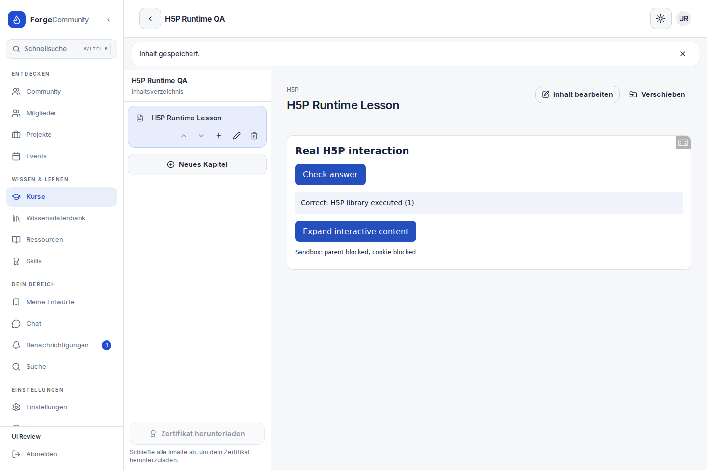
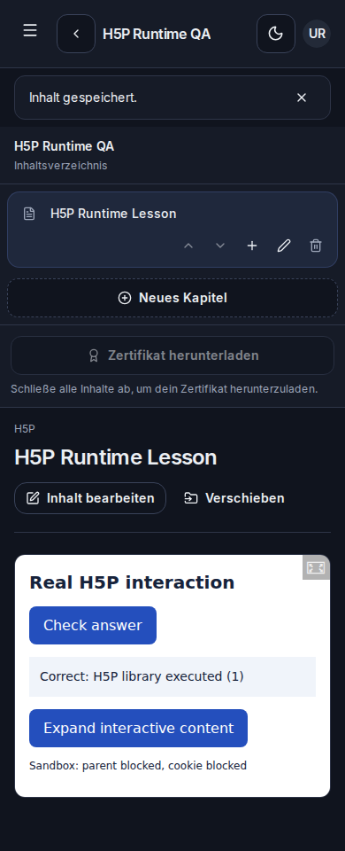

# H5P im Kurs

Im Kurseditor einen Inhalt vom Typ **H5P** öffnen. **H5P auswählen oder hochladen** zeigt die gespeicherten Pakete und nimmt eine `.h5p`-Datei entgegen. Nach dem Upload ist das echte Paket im Entwurf ausgewählt; **Speichern** verknüpft es mit dem Kursthema. Vorhandene Pakete lassen sich erneut verwenden.

Eine externe Einbettungs-URL oder der komplette iframe-Einbettungscode kann weiterhin direkt in das Quellenfeld eingefügt werden. Der externe Anbieter muss die Einbettung erlauben. Der Player verarbeitet das H5P-Protokoll zur Größenanpassung, damit längere Übungen nicht in einem festen Videoformat abgeschnitten werden.

## Pakete

Die Datei muss einen vollständigen H5P-Export mit `h5p.json`, `content/content.json` und allen benötigten Bibliotheken enthalten. Fehlende Bibliotheken werden beim Import mit ihrem Namen gemeldet. Eine reine Bibliothek oder eine ZIP-Datei ohne H5P-Inhalt kann nicht als Kursübung verwendet werden. Inhalte können zum Beispiel mit einem bestehenden H5P-Autorenwerkzeug erstellt und als `.h5p` exportiert werden; diese Integration importiert und spielt die Pakete ab.

Der Upload erlaubt bis zu 50 MB. Die Extraktion begrenzt Dateianzahl und entpackte Größe und prüft Pfade, Bibliotheksabhängigkeiten und ZIP-Daten. Fehler erhalten den Kursentwurf und die gewählte Datei für einen erneuten Versuch.

## Betrieb

Der Player wird aus der festgelegten Version von `h5p-standalone` beim Build nach `public/h5p-runtime` kopiert. Bibliotheken, Schriftdateien und Styles liegen im Image; ein CDN ist nicht erforderlich. `npm run dev` bereitet die Dateien ebenfalls vor.

Pakete liegen privat unter `data/h5p`. Mit `H5P_STORAGE_PATH` kann ein anderer absoluter Speicherpfad gesetzt werden. Im Docker-Standardbetrieb bleibt dieser Ordner im vorhandenen SQLite-Datenvolume erhalten. Der PostgreSQL-Compose-Stack verwendet das zusätzliche Volume `h5p_data`. Bei einem Backup müssen Datenbank **und** Paketordner gesichert werden.

Der Zugriff auf lokale Inhalte wird für Eigentümer, Administratoren und berechtigte Kursteilnehmer geprüft. Ressourcen verwenden kurzlebige, paketgebundene Tokens. Importierter Bibliothekscode läuft in einer iframe-Sandbox ohne Zugriff auf die App-Sitzung oder das übergeordnete Dokument.

Die Interaktion und das Feedback werden vom jeweiligen H5P-Inhalt ausgeführt. Diese Integration fügt keine zentrale xAPI-Ergebnisdatenbank und keinen integrierten H5P-Autoreneditor hinzu.

## Prüfung

313 Tests in 51 Suiten, ESLint ohne Warnungen, Typecheck und Produktionsbuild bestanden. 18 Browserprüfungen führen ein vollständiges synthetisches `.h5p`-Paket mit echter H5P-Bibliothek aus: Upload, Kursverknüpfung, Neuladen, Antworten und Feedback, Vergrößern und Verkleinern sowie erneute Auswahl. Geprüft wurden 1440 px im hellen Modus und 390 px im Darkmode. Der Test prüft außerdem gesperrten Zugriff auf das übergeordnete Dokument und Sitzungscookies, Lernendenrechte, Fremdzugriff und fehlerhafte Pakete.

Der Docker-HTTP-Smoke prüft Import, private Ressourcen, Player-Dateien und Berechtigungen. Nach Container-Neuerstellung prüft er denselben gespeicherten Inhalt erneut. Die Tests verwenden ausschließlich isolierte Testdaten. Externe H5P-Anbieter und sämtliche Drittanbieter-Inhaltstypen sind nicht einzeln Gegenstand der Browserprüfung.

