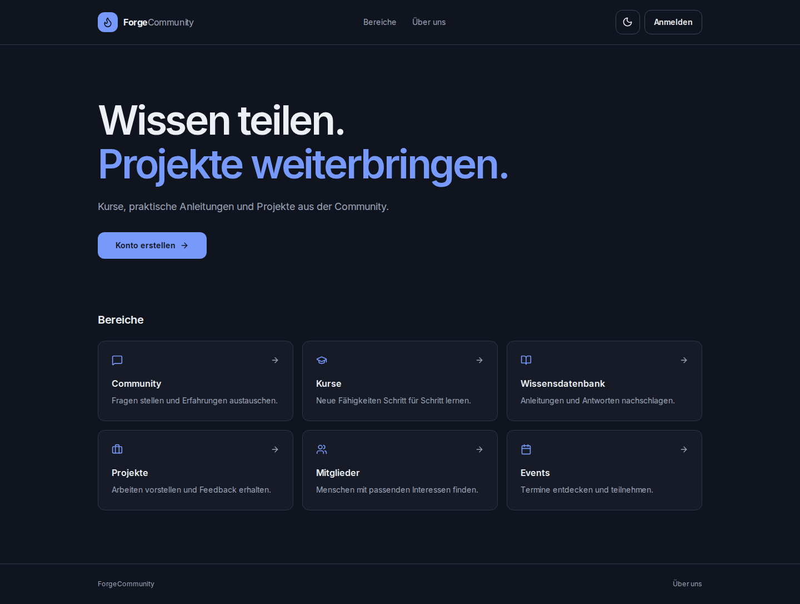
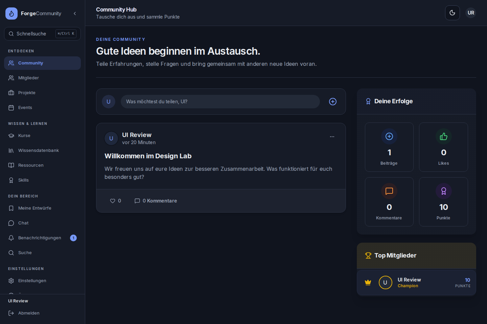
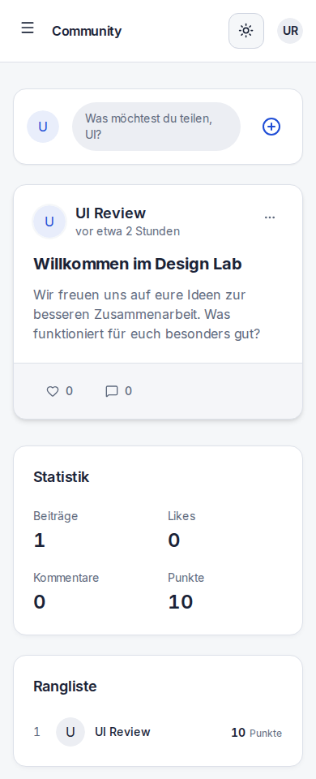
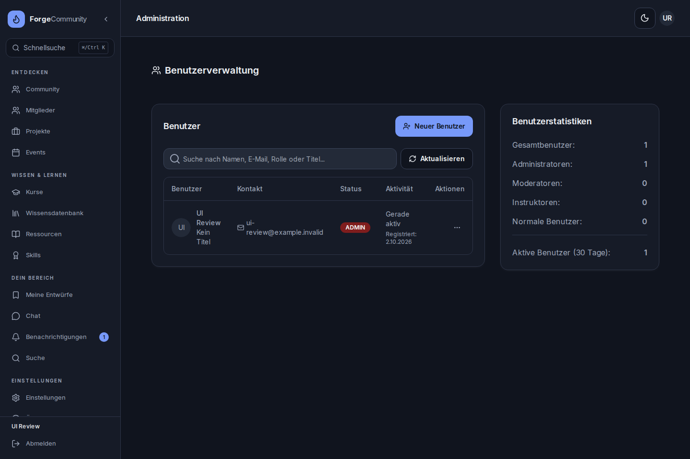

# ForgeCommunity: UI-Modernisierung

## Designrichtung

ForgeCommunity soll wie ein zusammenhängendes Produkt wirken: klar, ruhig und freundlich. Cobalt ist der primäre Akzent; helle Flächen und dunkle Typografie geben Inhalten Raum. Der Dark Mode verwendet dieselben semantischen Tokens mit abgestimmten Farben. Keine erfundenen Kennzahlen, Aktivitätsmeldungen oder Funktionen.

Der gewünschte Hallmark-Skill war in dieser Arbeitsumgebung weder im Skill-Katalog noch lokal verfügbar. Die Umsetzung basiert auf der bestehenden Next.js-/Radix-/Tailwind-Architektur.

## Gemeinsame Grundlage (umgesetzt)

- `AppShell` besitzt den mobilen Navigationszustand und begrenzt den Viewport mit `100dvh`. Inhalt und Navigation scrollen unabhängig, Formulare außerhalb der App bleiben scrollbar.
- `AppHeader` vereinheitlicht die Seitenköpfe und stellt auf jeder internen Seite denselben Menübutton bereit. Bestehende fachliche Aktionen bleiben erhalten.
- Navigation in Entdecken, Wissen & Lernen und persönlicher Bereich gegliedert. Unterseiten behalten die passende Markierung; Entwürfe markieren nicht zusätzlich die Wissensdatenbank. Projekte und ihre Detailseiten gehören zusammen.
- Desktop-Navigation einklappbar; Einstellung wird gespeichert. Mobile Navigation verwendet einen Radix-Dialog mit Fokusführung, Escape und Rückgabe des Fokus.
- Schnellsuche per Strg/⌘+K mit Bereichswechsel und Übergabe des Suchbegriffs an die bestehende Inhaltssuche. Administrative Ziele nur für Administratoren sichtbar; die bestehende serverseitige Autorisierung bleibt maßgeblich.
- Gemeinsame Farb-, Radius-, Fokus- und Oberflächentokens; konsistente Buttons, Formulare, Karten und Tabs. Mobile Eingaben verwenden 16 px, um automatischen iOS-Zoom zu vermeiden.
- Dialoge passen in den mobilen Viewport und scrollen bei langen Formularen. Reduzierte Bewegung respektiert `prefers-reduced-motion`.
- Skip-Link, beschriftete Aktionen, zugänglicher Editor und passende Lade-/Fehlerzustände.

## Seitenübergreifende Verbesserungen

| Seite / Route | Konkrete Verbesserung in dieser Änderung |
| --- | --- |
| Startseite `/` | Neuer Einstieg, klare Aussage, direkte Wege zum Austausch, Lernen und Projekten; normale mobile Seitennavigation statt erzwungenem Scroll-Snapping. |
| Login `/login` | Ruhiges Formular, Passwortanzeige, Autocomplete, sichtbarer Ladezustand, sichere lokale Rückleitung; native Formularübermittlung per POST und Anmeldung erst nach Client-Initialisierung; Google nur bei konfiguriertem Provider. |
| Registrierung `/register` | Gleiche Gestaltung und Bedienung wie Login; echte Passwortanforderungen; verständlicher Zustand nach erfolgreicher Registrierung bei fehlgeschlagenem Autologin; tote Links entfernt. |
| Abmeldung `/logout` | Verständlicher Ladezustand und Wiederholung im Fehlerfall. |
| Community `/community` | Klare Einführung, erreichbarer Composer, lokale Avatar-Initialen, Ladeanzeige und zugängliche Rückmeldungen; ruhigere Beitragskarten. |
| Mitglieder `/members` | Einheitlicher Einstieg, erreichbare Profilkarten und Filter, verständliche leere Ergebnisse, sinnvolle Sortierung und ein einziger Inhalts-Scrollbereich. |
| Profil `/profile/[id]` | Mobile Statistiken/Aktionen/Tabs, zugängliche Medienaktionen und korrigierter Chat-Link; konsistente Unterkomponenten. |
| Kurse `/courses` | Klarer Einstieg, Suche/Kategorien, Lade- und Fehlerzustände innerhalb der Oberfläche; Navigation bleibt beim Laden sichtbar. |
| Neuer Kurs `/courses/new` | Gemeinsamer Seitenrahmen, Formularfarben und Hierarchie; Datepicker submitten nicht mehr versehentlich das Formular; doppelte Erstellung blockiert und Fehler inline erklärt. |
| Kursdetails `/courses/[courseId]` | Bestehende Weiterleitung zum Kursplayer bleibt erhalten. |
| Kursplayer `/courses/[courseId]/contents` | Responsive, vollständig einklappbare Inhaltsnavigation; getrennte Öffnen-/Umbenennen-Aktionen; tatsächliches Umschalten des Gelesen-Status; korrektes Fortschrittsereignis je Kurs und verständliche Zertifikatfehler. |
| Events `/events` | Responsive Such-/Aktionsleiste, mobile Wochenagenda, Tastaturbedienung der Tage, Eventvorschau; heutige Events sichtbar, kein doppelter Bearbeitungsdialog. |
| Wissensdatenbank `/knowledgebase` | Klarer Einstieg, eine Suchleiste, Tastaturbedienung der Tagfilter, unterscheidbare Lade-/Fehler-/Leerzustände, kompletter Filter-Reset. |
| Artikel `/knowledgebase/[id]` | Gemeinsamer Rahmen, semantische Farben, lesbare Detailansicht. |
| Neuer Artikel `/knowledgebase/new-article` | Klare Einführung, konsistente Aktionen, Felder und Editor. |
| Artikel bearbeiten `/knowledgebase/[id]/edit`, `/knowledgebase/edit/[id]` | Beide bestehenden Einstiegspfade behalten; gemeinsamer Rahmen und konsistente Formulare. |
| Entwürfe `/knowledgebase/drafts` | Klarer persönlicher Bereich, konsistente Karten und Bearbeitungs-/Veröffentlichungsaktionen. |
| Ressourcen `/resources` | Klarer Einstieg, einheitliche Suche/Filter/Dialogs und Karten; Pagination unabhängig von Kartenanzahl, transparenter Filterumfang und manuelles Nachladen. |
| Ressourcendetails `/resources/[id]` | Gemeinsamer Rahmen, konsistente Metadaten und Vorschau. |
| Projekte `/showcases` | Responsive Karten/Listen, Like-/Löschaktionen von der Navigation getrennt; korrekt positionierte Bildvorschau. |
| Projekt `/projects/[projectId]` | Bearbeiten/Löschen für Eigentümer erreichbar; Like/Unlike synchronisiert; vollständige geladene Kommentare und erreichbarer Kommentarabschnitt. |
| Experimenteller Projektpfad `/projects/[id]test` | Weiterleitung zur regulären Detailseite statt abweichender Ansicht mit funktionslosen Aktionen. |
| Neues Projekt `/projects/new` | Vollständiger App-Rahmen, sichere Links/Vorschau, Textvalidierung statt HTML-Länge, klare Fehler und Abbrechen. |
| Skills `/skills` | Responsive Filter/Tabs, korrekte Sortierung nach Bestätigungen, Sperre mehrfacher Bestätigung und synchronisierte Detailansicht. |
| Chat `/chat` | Channelwahl auf dem Handy, zugängliche Channelbuttons, robuste Nachrichtenbreiten, beschriftete Aktionen und Sperre gegen Doppelsenden; erneute Channelwahl erhält den Verlauf. |
| Benachrichtigungen `/notifications` | Responsive Werkzeugleiste, eindeutige Alle/Ungelesen-Filter und Zähler, gut erreichbare Gelesen-Aktion. |
| Suche `/search` | Klarer Einstieg, konsistente Ergebnisansicht, Übernahme des Suchbegriffs aus der Schnellsuche. |
| Einstellungen `/settings` | Mobile Tabs und Zertifikatsaktionen; Speichern erst nach geladenem Profil; keine erfundenen Formularwerte. |
| Über uns `/about` | Gemeinsamer Rahmen, konsistente Farben und mobile Darstellung. |
| Administration `/admin/dashboard`, `/admin/users` | Ein gemeinsamer Seitenkopf, responsive Tabellen/Detailtabs, semantische Karten/Formulare; funktionslose Menüaktionen entfernt und bestehender serverseitiger Admin-Schutz erhalten. |
| Zertifikat `/verify-certificate/[certificateId]` | Deutsche, responsive Prüfung; ungültiges Zertifikat und Netzwerkfehler klar getrennt; Wiederholung und Abbruch veralteter Anfragen. |

## Konkrete nächste Produktverbesserungen

Diese Punkte sind Vorschläge und werden nicht als bereits umgesetzt dargestellt:

1. **Einheitliche Autoren-Workflows:** Entwurf, Vorschau, Veröffentlichungsstatus und Speichern-Rückmeldung für Artikel, Kurse und Projekte aus einem gemeinsamen Muster aufbauen. Ungespeicherte Änderungen beim Verlassen gezielt schützen.
2. **Serverseitiges Finden:** Suche, Sortierung und Filter bei Ressourcen und Mitgliedern für große Datenmengen serverseitig zusammenführen; Suchzustand in der URL speichern, damit Ergebnisse teilbar sind und Zurück funktioniert.
3. **Persönlicher Lernbereich:** Begonnene Kurse, nächster Lerninhalt und Zertifikate zentral erreichbar machen. Dafür ausschließlich echten gespeicherten Fortschritt nutzen.
4. **Strukturierter Community-Feed:** Echte Themen-/Tagfilter und nachvollziehbare Reihenfolge, mit Pagination statt Laden sämtlicher Beiträge beim ersten Besuch.
5. **Projektfeedback:** Gemeinsames Muster für Antworten, Zustände beim Speichern und Eigentümeraktionen; Autorenfeedback und technische Tags besser voneinander trennen.
6. **Admin-Tabellen:** Filter-/Sortierzustand persistieren, eindeutige Bestätigung bei riskanten Sammelaktionen und transparente Berechtigungen in der Oberfläche.
7. **Regressionen automatisieren:** Dauerhafte Browserprüfungen für 390 px und Desktop, Light/Dark, Tastaturnavigation, wichtige Formulare und Dialoge in die CI aufnehmen.

## Sicherheitsupdates vor dem Merge

Die GitHub-CI meldete beim ersten Lauf neu veröffentlichte Advisories für die vorhandenen Pakete. Next.js und die zugehörige ESLint-Konfiguration werden auf 16.3.8 aktualisiert, DOMPurify auf 3.4.16. Die Fixgrenzen sind in [GHSA-vcvr-r3jv-pc5j](https://github.com/advisories/GHSA-vcvr-r3jv-pc5j) und [GHSA-p98j-92pf-mc4p](https://github.com/advisories/GHSA-p98j-92pf-mc4p) dokumentiert. Die Next.js-Lücke betrifft bestimmte Verwendungen von `next/og` mit fremden SVG-Werten; diese API wird in der App nicht eingesetzt. Der vorhandene Audit-Check bleibt unverändert. Nach dem Update meldet `npm audit` 0 bekannte Schwachstellen; die 221 Tests und ESLint ohne Warnungen bestanden erneut.

## Prüfung

Die Änderung wurde mit bestehenden und neuen Regressionstests und einer lokalen Browserprüfung mit isolierter SQLite-Testdatenbank geprüft. 42 Testsuiten mit 221 Tests bestanden; ESLint ist ohne Warnungen sauber. Produktionsbuild und finale Typprüfung bestanden ebenfalls. Der Standalone-Server bestand 12 HTTP-Prüfungen; die Anmeldung, das Öffnen eines Kursinhalts, die nicht überlappenden Kopfzeilenaktionen und die 404-Seite wurden zusätzlich bei 390 und 1440 px im Produktionsbuild erfolgreich geprüft.

Die Browserprüfung sichtete zunächst 29 Routen bei 390 und 1440 px in Light/Dark (116 Kombinationen). Nach den Korrekturen bestanden 16 öffentliche Ansichten, 25 authentifizierte Desktopansichten sowie 20 gezielte Prüfungen mit geladenen Inhalten und 9 Navigations-/Composer-Interaktionen. Dazu gehören der mobile Drawer, Escape, Schließen nach Navigation, die einzelne Strg/⌘+K-Suche, gespeicherte Sidebar-Einstellung und der Erhalt des Chatverlaufs bei erneuter Channelwahl.

Auch Laufzeitfehler beim SSR der leeren Projektvorschau, beim Laden von Kategorien, bei reduzierter Bewegung im Animations-Fallback und beim Tailwind-Import im Entwicklungsstart wurden behoben. Die optionale CSS-Optimierung wurde entfernt, weil ihre nicht installierte Critters-Abhängigkeit Fehlerseiten beeinträchtigte. Stabile Komponentenidentitäten im Animations-Fallback verhindern den Verlust von Formularfokus und Eingaben.

Grenzen: Die Browserprüfung verwendet Chromium mit responsiven Viewports, kein echtes Safari-/iOS-Gerät. Externe Embeds wurden nicht vollständig geprüft. Produktionsdaten wurden nicht verändert; Datenbank und Fixtures werden nicht mitgeliefert.

## Review-Ansichten

Screenshots aus einer isolierten Testumgebung mit synthetischen Inhalten, aufgenommen in Chromium bei 390 und 1440 px.

